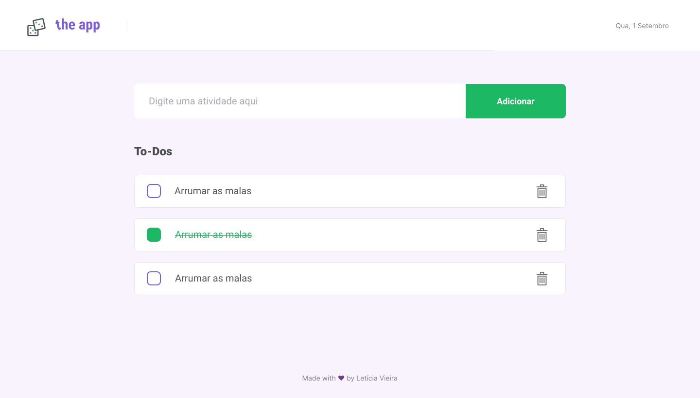

<h1 align="center">
  <a href="http://lvieira268.pythonanywhere.com/">
    
  </a>
</h1>
<p align="center">
  <a href="https://img.shields.io/github/repo-size/lvieira268/the-app">
    
  </a>
  <a href="https://www.linkedin.com/in/lvieira268/">
    
  </a>
  <a href="https://github.com/lvieira268/the-app/commits/master">
    
  </a>
  <a href="https://img.shields.io/badge/license-MIT-brightgreen">
    
  </a>
</p>
<p align="center">
  <a href="#-Projeto">Projeto</a>&nbsp;&nbsp;&nbsp;|&nbsp;&nbsp;&nbsp;
  <a href="#-Technologies">Tecnologias</a>&nbsp;&nbsp;&nbsp;|&nbsp;&nbsp;&nbsp;
  <a href="#-Layout">Layout</a>&nbsp;&nbsp;&nbsp;|&nbsp;&nbsp;&nbsp;
  <a href="#-Como-Usar">Como usar</a>&nbsp;&nbsp;&nbsp;
</p>

## :computer: Projeto

<h1 align="center">
  
</h1>

## :rocket: Tecnologias

Tecnologias utilizadas neste projeto:

- [Django][django]
- [HTMX][htmx]

## :art: Layout

Layout prototipado utilizando a ferramenta [Figma](https://www.figma.com/) seguindo as normas mais atuais de UI/UX.

## :information_source: Como Usar

Para clonar e rodar essa aplicação, você precisa [Git](https://git-scm.com) + [Python 3][python] instalados na sua máquina.

Abra seu Terminal/PowerShell:

## Instale a Aplicação

```bash
# Clone o repositório
$ git clone https://github.com/lvieira268/the-app

# Acesse o diretório do repositório clonado
$ cd the-app

# Crie o ambiente virtual python
$ python -m venv .venv

# [Linux/macOS] Habilite o ambiente virtual criado
$ source .venv/bin/activate

# [Windows] Habilite o ambiente virtual criado
$ source .venv\Script\activate

# Instale as depedências
$ pip install -r requirements.txt

# Crie as migrações do seu projeto
$ python manage.py makemigrations

# Execute a migração dos projetos
$ python manage.py migrate
```

## Inicie a Aplicação

```bash
# Inicie o servidor web
$ python manage.py runserver

# disponível em 127.0.0.1:8000
```

### Obtenha mais detalhes com a documantação

```bash
# Inicie a documentação na sua máquina
$ mkdocs serve --dev-addr=0.0.0.0:8080

# disponível em 0.0.0.0:8080
```


Made with :heart: by Letícia Vieira :wave: [Get in touch!](https://github.com/lvieira268/)

[django]: https://www.djangoproject.com/
[htmx]: https://htmx.org
[jsonserver]: https://github.com/typicode/json-server
[python]: https://www.python.org/
